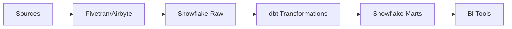

# One-Pager: Data Pipeline Modernization

## Problem Statement

Our current data pipeline infrastructure was built 5 years ago for a company processing 10GB of data daily. We now process 500GB daily, and the system is buckling under the load. Key issues include:

- **Latency**: End-to-end pipeline latency has grown from 15 minutes to 4 hours
- **Reliability**: Pipeline failures occur 3-4 times per week, requiring manual intervention
- **Cost**: We're paying 3x the industry benchmark for our data processing compute
- **Maintainability**: The pipeline code is a monolithic Python script with 15,000 lines of undocumented logic

## Context

The data team has grown from 2 to 12 people, but productivity has decreased as more time is spent on maintenance than analysis. Our competitors are shipping data-driven features 4x faster. The CFO has flagged data infrastructure costs as a concern in the last two board meetings.

## Proposed Solution

Migrate to a modern data stack built on cloud-native components:

1. **Ingestion**: Replace custom scripts with Fivetran for standard sources, Airbyte for custom sources
2. **Transformation**: Migrate from Python scripts to dbt (data build tool) for SQL-based transformations
3. **Orchestration**: Move from cron jobs to Dagster for pipeline orchestration
4. **Storage**: Consolidate on Snowflake as the single source of truth

## Key Goals

| Goal | Current | Target |
|------|---------|--------|
| Pipeline latency | 4 hours | 30 minutes |
| Weekly failures | 3-4 | < 1 |
| Monthly infrastructure cost | $45K | $25K |
| Time to add new source | 2 weeks | 2 days |

## Scope

### In Scope
- All production data pipelines
- Historical data migration (24 months)
- BI tool reconnection (Looker, Tableau)
- Documentation and runbooks

### Out of Scope
- Real-time streaming (separate initiative)
- ML feature store (Phase 2)
- Data governance tooling (Phase 2)

## Timeline

- **Week 1-2**: Architecture design and vendor selection
- **Week 3-6**: Set up new infrastructure, parallel runs
- **Week 7-10**: Migrate production workloads, validate data quality
- **Week 11-12**: Decommission legacy systems, knowledge transfer

## Risks

1. **Data quality during migration**: May discover undocumented transformations
2. **Vendor lock-in**: Snowflake costs may increase after initial contract period
3. **Team learning curve**: dbt requires SQL skills that some team members lack

## Resource Requirements

- 1 Data Engineer Lead (full-time, 12 weeks)
- 2 Data Engineers (full-time, 10 weeks)
- 1 Analytics Engineer (50%, for dbt model review)
- Budget: $50K for tooling licenses, $30K for professional services

## Decision Requested

Approve the modernization initiative and allocate the requested resources for Q2 2026.

